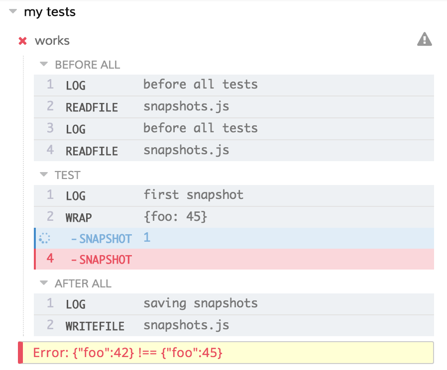

# @cypress/snapshot

> Adds value / object / DOM element snapshot testing support to Cypress test runner

[![NPM][npm-icon] ][npm-url]

[![Build status][ci-image] ][ci-url]
[![semantic-release][semantic-image] ][semantic-url]
[![renovate-app badge][renovate-badge]][renovate-app]

## Note

Please take a look at a few other Cypress snapshot plugins: [cypress-plugin-snapshots](https://github.com/meinaart/cypress-plugin-snapshots), [cypress-image-snapshot](https://github.com/palmerhq/cypress-image-snapshot).

## Install

Requires [Node](https://nodejs.org/en/) version 6 or above.

```sh
npm install --save-dev @cypress/snapshot
```

## Use

After installing, add the following to your `cypress/support/commands.js` file

```js
require('@cypress/snapshot').register()
```

This registers a new command to create new snapshot or compare value to old snapshot

```js
describe('my tests', () => {
  it('works', () => {
    cy.log('first snapshot')
    cy.wrap({ foo: 42 }).snapshot()
    cy.log('second snapshot')
    cy.wrap({ bar: 101 }).snapshot()
  })
})

describe('focused input field', () => {
  it('is empty and then typed into', () => {
    cy.visit('http://todomvc.com/examples/react/')
    cy
      .focused()
      .snapshot('initial')
      .type('eat healthy breakfast')
      .snapshot('after typing')
  })
})
```

By default, the snapshot object can be found in file `snapshots.js`. In the above case it would look something like this

```js
module.exports = {
  "focused input field": {
    "is empty and then typed into": {
      "initial": {
        "tagName": "input",
        "attributes": {
          "class": "new-todo",
          "placeholder": "What needs to be done?",
          "value": ""
        }
      },
      "after typing": {
        "tagName": "input",
        "attributes": {
          "class": "new-todo",
          "placeholder": "What needs to be done?",
          "value": "eat healthy breakfast"
        }
      }
    }
  },
  "my tests": {
    "works": {
      "1": {
        "foo": 42
      },
      "2": {
        "bar": 101
      }
    }
  }
}
```

If you change the site values, the saved snapshot will no longer match, throwing an error



Click on the `SNAPSHOT` step in the Command Log to see expected and current value printed in the DevTools.

### Options

You can control snapshot comparison and behavior through a few options.

```js
cy.get(...).snapshot({
  name: 'human snapshot name', // to use in the snapshot file
  json: false                  // convert DOM elements into JSON
                               // when storing in the snapshot file
})
```

### Configuration

This module provides some configuration options:

#### useRelativeSnapshots
Set to true in order to store your snapshots for each test run next to the inital test caller rather
than at the base working directory.

**Note:** requires the `readFileMaybe` plugin to be configured see https://on.cypress.io/task#Read-a-file-that-might-not-exist

#### snapshotFileName
Set to a string to name your snapshot something other than 'snapshots.js'

#### Usage
Set the configuration options as part of the Cypress config.
See https://docs.cypress.io/guides/references/configuration.html

## Debugging

To debug this module run with environment variable `DEBUG=@cypress/snapshot`

### Small print

Author: Gleb Bahmutov &lt;gleb@cypress.io&gt; &copy; Cypress.io 2017

License: MIT - do anything with the code, but don't blame u if it does not work.

Support: if you find any problems with this module, email / tweet /
[open issue](https://github.com/cypress-io/snapshot/issues) on Github

## MIT License

Copyright (c) 2017 Cypress.io &lt;gleb@cypress.io&gt;

Permission is hereby granted, free of charge, to any person
obtaining a copy of this software and associated documentation
files (the "Software"), to deal in the Software without
restriction, including without limitation the rights to use,
copy, modify, merge, publish, distribute, sublicense, and/or sell
copies of the Software, and to permit persons to whom the
Software is furnished to do so, subject to the following
conditions:

The above copyright notice and this permission notice shall be
included in all copies or substantial portions of the Software.

THE SOFTWARE IS PROVIDED "AS IS", WITHOUT WARRANTY OF ANY KIND,
EXPRESS OR IMPLIED, INCLUDING BUT NOT LIMITED TO THE WARRANTIES
OF MERCHANTABILITY, FITNESS FOR A PARTICULAR PURPOSE AND
NONINFRINGEMENT. IN NO EVENT SHALL THE AUTHORS OR COPYRIGHT
HOLDERS BE LIABLE FOR ANY CLAIM, DAMAGES OR OTHER LIABILITY,
WHETHER IN AN ACTION OF CONTRACT, TORT OR OTHERWISE, ARISING
FROM, OUT OF OR IN CONNECTION WITH THE SOFTWARE OR THE USE OR
OTHER DEALINGS IN THE SOFTWARE.

[npm-icon]: https://nodei.co/npm/@cypress/snapshot.svg?downloads=true
[npm-url]: https://npmjs.org/package/@cypress/snapshot
[ci-image]: https://travis-ci.org/cypress-io/snapshot.svg?branch=master
[ci-url]: https://travis-ci.org/cypress-io/snapshot
[semantic-image]: https://img.shields.io/badge/%20%20%F0%9F%93%A6%F0%9F%9A%80-semantic--release-e10079.svg
[semantic-url]: https://github.com/semantic-release/semantic-release
[renovate-badge]: https://img.shields.io/badge/renovate-app-blue.svg
[renovate-app]: https://renovateapp.com/
